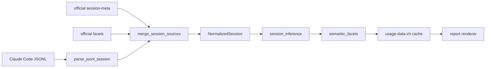

# claude-code-insight-zh Architecture

## Current shape

`claude-code-insight-zh` is a local-first Claude Code usage analyzer. It reads local Claude Code session records, builds a normalized session model, enriches each session with semantic facets, then renders Chinese Markdown or HTML reports.

The old standalone daily engine has been removed. Daily, weekly, monthly, and custom range reports now use the same command path:

```bash
python3 insight-zh.py 1 --html --save
python3 insight-zh.py 7 --html --save
python3 insight-zh.py 2026-05-01 2026-05-29 --html --save
```

## Data sources

The fact layer is local Claude Code JSONL:

- `~/.claude/projects/*/*.jsonl`

Official Claude `/insights` data is treated as an enhancement layer when present:

- `~/.claude/usage-data/session-meta/*.json`
- `~/.claude/usage-data/facets/*.json`

Generated Chinese cache and reports live separately:

- `~/.claude/usage-data-zh/session-meta/*.json`
- `~/.claude/usage-data-zh/facets/*.json`
- `~/.claude/usage-data-zh/reports/*.html`
- `~/.claude/usage-data-zh/reports/*.md`

## Pipeline



## Report Lens

The largest product variable is the report lens, not the raw data source.

The lens is defined in:

- `insight_zh/analysis/report_lens.py`

It controls:

- theme buckets;
- section titles and hints;
- topic explanation templates;
- behavior framing;
- reusable playbook rules.

It does not control factual counters or parser behavior. This keeps the system
split into three layers:

1. fact layer: JSONL and git log;
2. semantic layer: official facets, optional LLM facets, or heuristic fallback;
3. lens layer: report direction and narrative strategy.

Changing strategic direction should usually mean changing or adding a lens, not
editing the cache layer or source parser.

## Source priority

Facts come from JSONL first. Official `/insights` fields are allowed to enrich interpretation, but they do not override the local fact counters that the report depends on.

The current priority is:

1. JSONL facts: message counts, active duration, tools, edited/read/written files, timestamps.
2. Local git history: commit hashes inside the session time window, resolved from the underlying repository root.
3. Official `/insights` facets: goal, outcome, satisfaction, success, friction, summary.
4. `insight-zh` semantic fallback: deterministic inference for sessions that official `/insights` has not analyzed.

## Cache semantics

The Chinese cache stores analyzer output, not raw material. That means a cache entry is valid only for:

- the same source JSONL file fingerprint;
- the same related official facet/session-meta fingerprint;
- the same report date window;
- the same analyzer version hash.

Analyzer version hashes include the parser, session loader, inference layer, and semantic facets layer. If analysis logic changes, cached facets are invalidated automatically and rebuilt on the next report run.

## Metrics currently used

- Sessions: JSONL sessions with real user text inside the requested window.
- Messages: real user-authored messages only. Tool results, command wrappers, task notifications, and system continuation text are excluded.
- Duration: active time estimated from event gaps capped at 15 minutes. Wall-clock span is kept separately as `elapsed_duration_minutes`.
- Git activity: real commits found by `git log --all --since/--until` in the repo root. This counts underlying repository commits regardless of whether Claude Code, Codex, another AI, or the user made them.

## Semantic facets

Official `/insights` feels deeper because it stores interpretation fields such as:

- `underlying_goal`
- `brief_summary`
- `outcome`
- `claude_helpfulness`
- `primary_success`
- `friction_counts`
- `friction_detail`
- `user_satisfaction_counts`

When those fields exist, `insight-zh` preserves them. When they are absent, `insight-zh` now runs a deterministic semantic fallback over the normalized session. This fallback is not as strong as a full LLM read of the transcript, but it prevents empty/null reports and gives the report enough structure to reason about outcome, friction, and success.

The important design point: cache names do not change manually for each analysis idea. The analyzer hash changes automatically when the analysis code changes.

## LLM boundary

External LLM usage is enhancement only and is opt-in:

- `--translate` translates English official fields when configured;
- `--llm-advice` generates external-LLM coaching advice when configured.

Default reports do not require an API key and do not call external models, even if `INSIGHT_API_KEY` exists in the environment. Local rule-based advice is always available. External LLM output is not used as the source of factual counters such as session count, message count, duration, or git activity.
