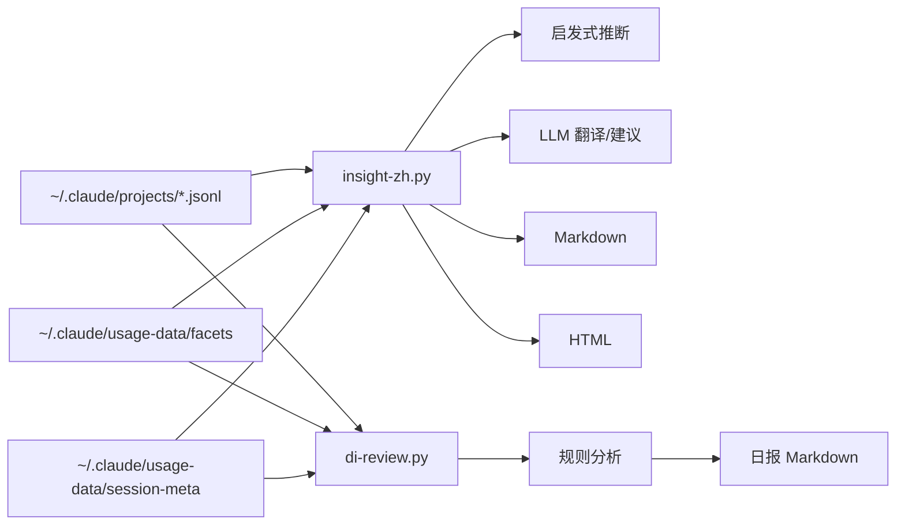
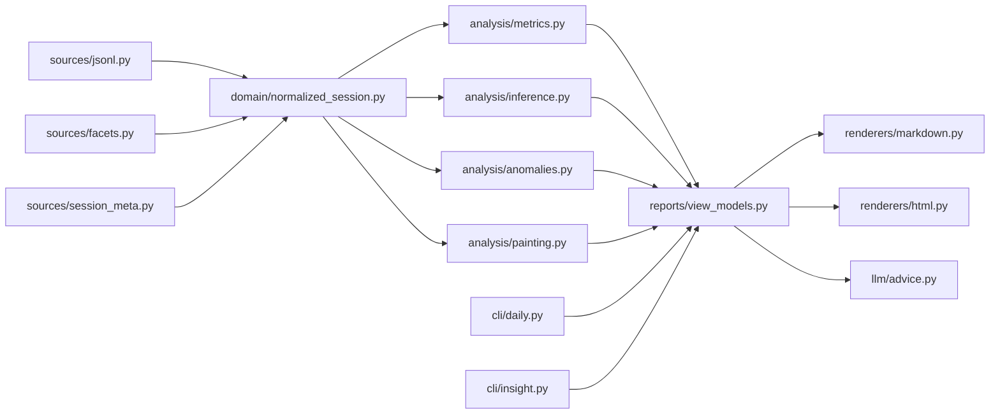

# claude-code-insight-zh 架构说明与重构路线

## 一句话结论

这个项目的**产品架构是成立的**，但**代码架构已经到脚本单体的上限**。

- `/daily` 和 `/weekly` `/monthly` 的双引擎拆分是对的
- 本地优先、单进程 CLI 形态是对的
- 真正的问题不是要不要拆服务，而是要不要补一个**共享内核**

当前更像是「两个能工作的脚本」，而不是「一个有边界的分析系统」。

## 当前快照

截至这份文档写下时，仓库核心文件规模大致如下：

- `insight-zh.py`：3648 行
- `di-review.py`：1149 行
- `README.md`：184 行
- `SKILL.md`：120 行

当前职责分布：

| 文件 | 当前职责 |
|------|----------|
| `di-review.py` | 日报模式：读取会话、规则分析、消息推断、输出 markdown |
| `insight-zh.py` | 周报/月报模式：读取会话、启发式推断、翻译、LLM 建议、异常检测、文本/HTML 渲染、CLI 出口 |
| `SKILL.md` | Claude Code 入口路由 |
| `README.md` | 用户文档 |

## 当前运行架构



这套结构的问题不在于「不能用」，而在于：

- 日报和深度报告共享同一个领域，但没有共享内核
- 数据接入、分析、渲染、缓存、CLI side effect 混在同一文件里
- 同一个概念在不同路径里重复定义，容易漂移

## 当前架构的优点

### 1. 产品分层是对的

`/daily` 追求秒出，`/weekly` `/monthly` 允许慢一点但要更深。这个 SLA 拆分很合理，避免了一个万能引擎既要快又要深。

### 2. 本地优先是对的

这是一个读取本地 Claude Code 痕迹数据的工具，不需要引入服务端、数据库或任务系统。继续坚持单机、离线可跑、低依赖是正确方向。

### 3. 数据源优先级基本合理

以 `jsonl` 原始记录为主，以 facets / session-meta 为增强，这比反过来更稳。原始数据更接近真实行为，增强数据更接近解释层。

## 当前架构的核心问题

### 1. 没有显式的规范化会话模型

当前没有一个统一的 `NormalizedSession` 概念。于是日报和深度报告各自解析、各自推断、各自聚合。

结果是：

- 同一条会话在 daily 和 weekly 链路里语义不一致
- 同一指标可能有两套实现路径
- 修一边很容易忘记另一边

这不是代码风格问题，而是**领域模型缺位**。

### 2. 分析层和渲染层强耦合

`generate_report()` 和 `generate_html_report()` 不是单纯 renderer，而是同时承担：

- 聚合统计
- 分类整理
- 业务文案
- 最终渲染

这意味着：

- 文本版和 HTML 版会重复实现相同逻辑
- 指标一改，两个地方都要动
- 很难做稳定测试

### 3. Side effect 没有被推到边界

当前核心脚本里混着：

- 环境变量读取
- 缓存读写
- 文件输出
- `open` 浏览器
- LLM 请求

纯计算和外部交互没有隔开，所以可测试性差，失败模式也不清晰。

### 4. 日报与周报是“分叉”，不是“组合”

现在 `di-review.py` 和 `insight-zh.py` 更像两套独立实现，而不是共享一个分析核心后输出不同视图。

这会带来两个问题：

- 重复代码不断增长
- 行为差异越来越难解释

### 5. 项目已经从“脚本”长成“隐式框架”

当一个文件超过 3000 行，还同时负责数据接入、规则分析、LLM、缓存、HTML、CLI，它实际上已经是一个框架，只是还没有承认这件事。

这会让未来新增功能越来越贵：

- 季报
- 项目维度分析
- 导出 JSON
- Web 界面
- 多语言输出

任何一个需求，都会继续挤进大脚本。

## 架构约束与不变项

这几个点我建议视为明确约束，不要在重构时动摇：

### 1. 不拆服务

这个项目不需要后端服务，不需要数据库，不需要消息队列，不需要任务系统。目标是**把脚本单体重构成模块化单体**，不是把它做重。

### 2. 继续以本地文件为主数据源

数据事实仍来自：

- `~/.claude/projects/*/*.jsonl`
- `~/.claude/usage-data/facets/`
- `~/.claude/usage-data/session-meta/`

### 3. 保持三种模式不变

用户入口仍然应该是：

- `/daily`
- `/weekly`
- `/monthly`

### 4. 绘画方法论和双轮轰炸结构保留

这是产品层特征，不是实现偶然性。重构时应保留：

- 画室观察笔记
- Karpathy 深度建议

### 5. LLM 是增强层，不是事实层

LLM 可以翻译、解释、给建议，但不能成为事实统计的来源。事实层必须来自结构化数据和可复现规则。

## 目标架构

目标不是“更先进”，而是“更稳定、更可改”。

建议把系统重构成下面这条流水线：



这背后的核心思想是：

- **source adapter** 只负责读取数据
- **normalized session** 负责统一结构
- **analysis** 负责得出中间结论
- **view model** 负责把分析结果整理成可展示对象
- **renderer** 只负责展示
- **CLI** 只负责参数、落盘、打开文件

## 建议的目录结构

重构后建议形态：

```text
claude-code-insight-zh/
  docs/ARCHITECTURE.md
  README.md
  SKILL.md
  requirements.txt

  insight_zh/
    __init__.py

    cli/
      daily.py
      insight.py

    sources/
      jsonl_source.py
      facets_source.py
      session_meta_source.py

    domain/
      session.py
      report_models.py

    analysis/
      metrics.py
      inference.py
      painting.py
      anomalies.py

    llm/
      translate.py
      advice.py

    cache/
      translation_cache.py
      advice_cache.py

    renderers/
      markdown.py
      html.py

  di-review.py
  insight-zh.py
```

其中：

- `di-review.py` 和 `insight-zh.py` 继续保留，但变成**薄 wrapper**
- 真正逻辑进 `insight_zh/` 包
- 这样既不破坏现有入口，也为后续测试和扩展建立边界

## 关键对象设计

### 1. NormalizedSession

建议引入统一的会话领域对象，至少包含：

```text
session_id
project_path
start_time
end_time
report_date
duration_minutes

user_message_count
assistant_message_count
tool_counts
input_tokens
output_tokens
git_pushes

first_prompt
all_user_texts

facet_fields
meta_fields

derived:
  goal_categories
  friction_counts
  outcome
  helpfulness
  painting_stage
  energy_flow
```

注意这里的重点不是 dataclass 语法，而是：

- 所有链路都用同一个 schema
- 推断字段和原始字段能明确区分
- 所有 renderer / analysis 都只吃这个对象

### 2. ReportViewModel

建议在 renderer 之前，再做一个面向展示的聚合对象，例如：

```text
date_range
session_count
tool_summary
goal_summary
friction_summary
outcome_summary
painting_notes
anomalies
advice
timeline
detail_indexes
```

这样可以避免：

- HTML 和 Markdown 重复聚合
- 每个 renderer 自己做业务判断

## 应该保留的架构决策

### ADR-001：保持单进程 CLI 架构

原因：

- 本地工具不需要服务化
- 使用成本低
- 维护成本低

### ADR-002：`jsonl` 是事实主源，facets/meta 是增强源

原因：

- 原始日志更接近真实行为
- facets 解释性强但覆盖不一定完整
- meta 提供高价值结构化字段

### ADR-003：LLM 是增强器，不是裁判

原因：

- 统计结果必须可复现
- LLM 适合解释和建议，不适合做基础事实判断

### ADR-004：保留薄 wrapper，逐步迁移

原因：

- 不破坏用户现有命令入口
- 降低迁移风险

## 分阶段重构路线

### Phase 0：冻结行为，补最小回归

目标：在重构前先锁住当前关键行为。

最少需要覆盖：

- 跨天会话的日期归属
- JSONL + facets/meta 的合并规则
- push 口径统一
- advice cache 按时间范围分桶
- 文本和 HTML 的关键指标一致

完成标准：

- 后续抽模块时，核心行为不会悄悄回归

### Phase 1：抽出统一数据接入层

把以下逻辑从大脚本抽走：

- 读取 jsonl
- 读取 facets
- 读取 session-meta
- 合并为统一 session 结构

交付物：

- `sources/*.py`
- `domain/session.py`

完成标准：

- `di-review.py` 和 `insight-zh.py` 都不再直接操作底层文件格式

### Phase 2：抽出共享分析层

把这些逻辑移到 `analysis/`：

- goal / friction / outcome 推断
- painting / energy 分析
- 指标聚合
- anomaly 检测

完成标准：

- daily 和 weekly/monthly 都调用同一套分析函数

### Phase 3：抽出 ReportViewModel 和 renderer

把当前 `generate_report()` 与 `generate_html_report()` 里混合的聚合逻辑拆开：

- `reports/view_models.py` 只产出报告数据模型
- `renderers/markdown.py` 只负责 markdown
- `renderers/html.py` 只负责 HTML

完成标准：

- 任何一个新指标只需要在 view model 增一次，不需要 HTML 和 markdown 各写一次聚合

### Phase 4：隔离 LLM 与缓存层

把下面这些抽出去：

- 翻译缓存
- advice 缓存
- 翻译请求
- 深度建议请求

放到：

- `llm/translate.py`
- `llm/advice.py`
- `cache/*.py`

完成标准：

- 核心分析在无 API key 时仍可完整运行
- LLM 故障不会污染事实层

### Phase 5：入口瘦身

最后再把：

- `insight-zh.py`
- `di-review.py`

改成薄 CLI wrapper。

职责仅保留：

- parse args
- 调用 use case
- 保存报告
- 打开文件

完成标准：

- 入口文件都降到几百行以内

## 现在不该做的事

### 1. 不要一上来重写全部逻辑

这个项目已经有行为和用户心智，直接推倒重写的风险很高。

### 2. 不要先做 Web 化

没有共享内核之前上 Web，只会把脚本问题搬到前后端边界上。

### 3. 不要过早抽象成插件系统

现在问题不是扩展性，而是边界。插件系统会把问题扩大。

### 4. 不要为了“优雅”牺牲可迁移性

优先选择**可渐进迁移**的结构，而不是最漂亮的结构。

## 近期建议的执行顺序

如果接下来只做 3 步，我建议按这个顺序：

1. 先补最小回归测试，冻结关键行为
2. 再抽 `NormalizedSession` 和数据接入层
3. 然后把 `generate_report()` / `generate_html_report()` 前面的聚合逻辑挪到共享 view model

## 最后的判断

这个项目不是方向错了，而是成长阶段变了。

它已经不是一个「随手写的脚本」，而是一个：

- 有多数据源
- 有双引擎
- 有推断层
- 有 LLM 增强层
- 有双 renderer
- 有缓存
- 有稳定用户入口

的本地分析系统。

接下来最重要的不是继续往 `insight-zh.py` 里加功能，而是先承认它已经是一个系统，然后给它补上系统该有的边界。