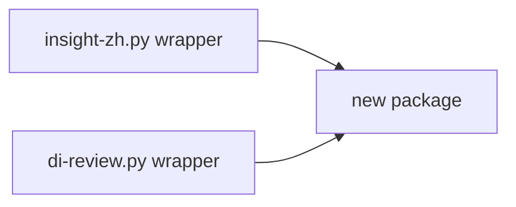

# 模块拆分草图

## 目标

把当前两个脚本里的隐式边界显式化，但不改变用户入口。

保留：

- `di-review.py`
- `insight-zh.py`

新增一个真正承载核心逻辑的包：

```text
insight_zh/
  cli/
  sources/
  domain/
  analysis/
  llm/
  cache/
  renderers/
```

## 当前函数到目标模块的映射

### 一、数据接入层

当前代码位置：

- `insight-zh.py::load_data()`
- `insight-zh.py::load_data_from_jsonl()`
- `di-review.py::parse_jsonl()`
- `di-review.py::load_sessions()`

目标拆分：

- `insight_zh/sources/jsonl_source.py`
  - 负责读取 `~/.claude/projects/*/*.jsonl`
  - 输出原始事件或中间结构
- `insight_zh/sources/facets_source.py`
  - 负责读取 facets
- `insight_zh/sources/session_meta_source.py`
  - 负责读取 session-meta
- `insight_zh/sources/session_loader.py`
  - 负责把三个来源合并成统一 session 对象

核心约束：source 只读数据，不做业务判断。

### 二、领域模型层

当前缺失。

目标新增：

- `insight_zh/domain/session.py`
  - `NormalizedSession`
- `insight_zh/domain/report_models.py`
  - `ReportViewModel`

核心职责：

- 保存统一字段
- 区分原始字段与派生字段
- 为 analysis 与 renderer 提供稳定输入

### 三、分析层

当前代码位置：

- `classify_goal()`
- `infer_goal_categories()`
- `infer_friction_counts()`
- `infer_session_labels()`
- `generate_painting_analysis()`
- `detect_anomalies()`
- 日报里的消息/摩擦/达成分析函数

目标拆分：

- `insight_zh/analysis/inference.py`
  - goal / friction / outcome / helpfulness 推断
- `insight_zh/analysis/metrics.py`
  - 聚合指标、时段分布、push 率等
- `insight_zh/analysis/painting.py`
  - 绘画方法论分析
- `insight_zh/analysis/anomalies.py`
  - 异常信号检测

核心约束：analysis 只做判断和计算，不直接拼 markdown/html。

### 四、LLM 与缓存层

当前代码位置：

- `translate_batch()`
- `load_translation_cache()`
- `save_translation_cache()`
- `generate_coaching_advice()`
- `get_advice_cache_path()`

目标拆分：

- `insight_zh/llm/translate.py`
- `insight_zh/llm/advice.py`
- `insight_zh/cache/translation_cache.py`
- `insight_zh/cache/advice_cache.py`

核心约束：

- LLM 是增强层
- 缓存策略集中管理
- 失败时不影响事实层产出

### 五、渲染层

当前代码位置：

- `generate_report()`
- `generate_html_report()`
- `_md_lines_to_html()`
- `_md_bold()`

目标拆分：

- `insight_zh/renderers/markdown.py`
- `insight_zh/renderers/html.py`

前提：先有 `ReportViewModel`

核心约束：renderer 只消费 view model，不再自己做统计汇总。

### 六、CLI 入口层

当前代码位置：

- `insight-zh.py::main()`
- `di-review.py::main()`

目标拆分：

- `insight_zh/cli/insight.py`
- `insight_zh/cli/daily.py`

保留 wrapper：

- 根目录 `insight-zh.py`
- 根目录 `di-review.py`

wrapper 最终只保留：

- 参数解析
- 调用 use case
- 保存报告
- 打开文件

## 推荐依赖方向

只能这样依赖：

```text
cli -> sources/domain/analysis/llm/renderers
sources -> domain
analysis -> domain
llm -> domain/cache
renderers -> domain
```

不能这样依赖：

- renderer 反向依赖 source
- analysis 反向依赖 CLI
- source 里直接生成 markdown/html

## 重构过程中的防腐层

在迁移过程中，允许存在短期 adapter，但要控制住方向：

- 旧脚本调用新模块：可以
- 新模块反过来 import 旧脚本：不可以

所以过渡期应是：



而不是：


## 第一批最值得抽的东西

如果只抽 20% 的东西来解决 80% 的问题，我建议顺序是：

1. `NormalizedSession`
2. 统一 session loader
3. 统一 push 计数 helper
4. `ReportViewModel`
5. markdown/html renderer 分离

原因很简单：

- 这些地方决定边界
- 这些地方一旦稳定，后面怎么拆都不会乱

## 不建议一开始就抽的东西

- UI 文案细节
- CSS 结构优化
- 所有启发式规则细拆到几十个文件
- 插件化机制
- 配置中心

先把主干拆出来，比先把枝叶雕花更重要。